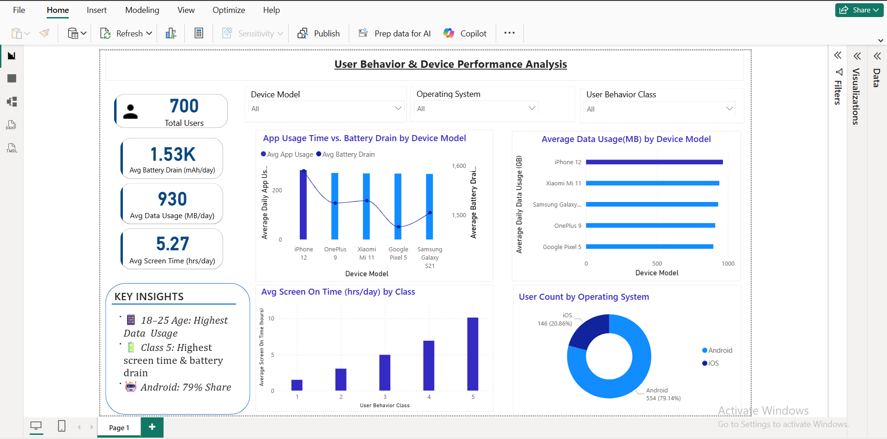

# 📊 User Behavior & Device Performance Analysis (Power BI)

## 📌 Overview
This project presents an interactive Power BI dashboard analyzing user behavior and device performance. It helps identify patterns in app usage, battery consumption, and data usage across different devices and user segments.

---

## 🛠 Tools Used
- Microsoft Power BI  
- Data Visualization Techniques  
- Data Cleaning & Transformation  

---

## 📷 Dashboard Preview

---

## 📊 Key Insights
- 📱 Users aged 18–25 show the highest data usage  
- 🔋 User Class 5 has the highest screen time and battery drain  
- 🤖 Android users dominate with ~79% market share  
- 📈 Significant variation in app usage across device models  

---

## 📁 Files Included
- `User_Behavior_Device_Analysis.pbix` – Power BI dashboard file  
- `PowerBI_Dashboard.png` – Dashboard preview image  

---

## 🎯 Conclusion
The dashboard provides actionable insights into user engagement and device performance, helping businesses optimize app performance and target high-usage segments effectively.
